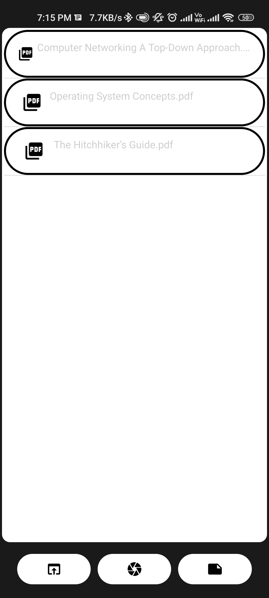
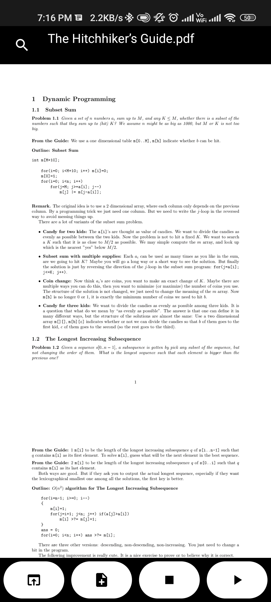
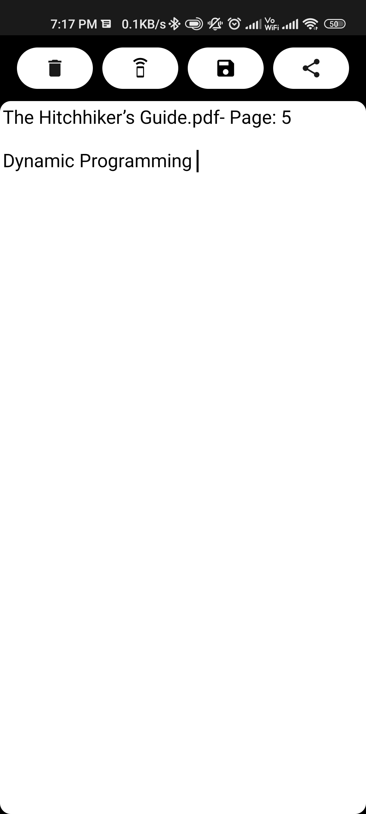

## SmartReader
App provides audio-visual-book experience for pdf files. It is also capable of scanning through text and user can creating custom notes.

It uses the following APIS to attain above functions

* [For Scanning] Google Vision API
* [For Text-to-Speech] Google Text-to-Speech API
* [For Pdf Viewer] barteksc-AndroidPdfViewer

## Screenshots

